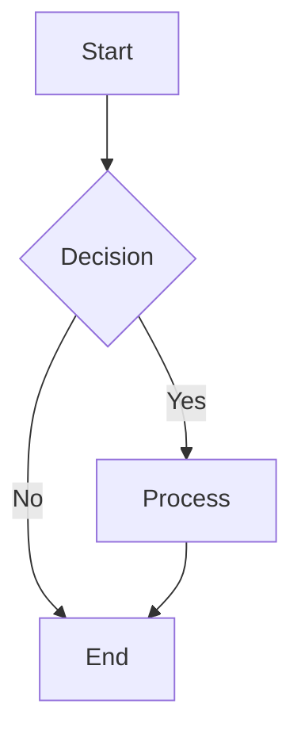
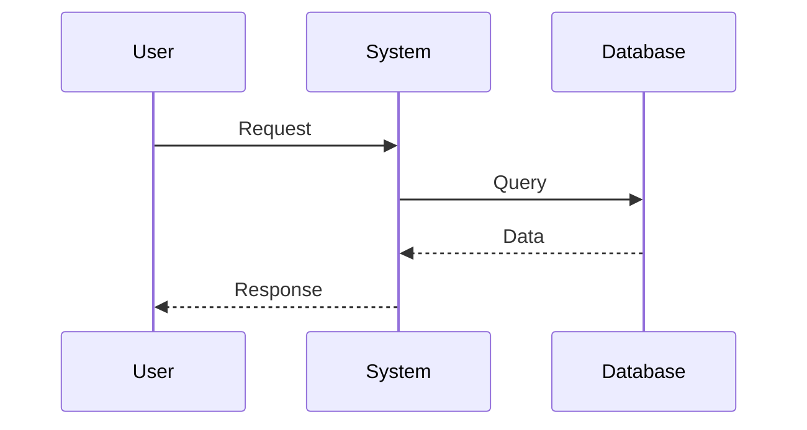
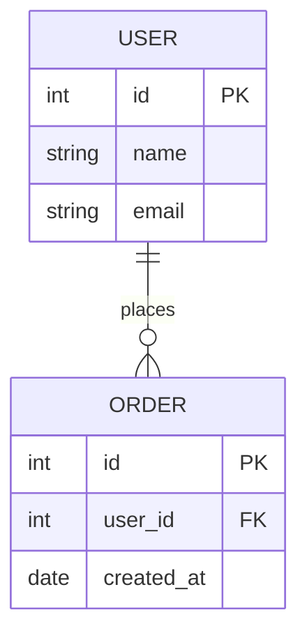

# 🎨 Diagram Editor Setup Guide

## Overview
The new diagram editor allows users to create, edit, and export interactive Mermaid diagrams with live preview, theme customization, and multiple export formats.

## 🚀 Features
- **Live Mermaid Preview** - Real-time diagram rendering
- **Interactive Editor** - Syntax highlighting and validation
- **Multiple Export Formats** - PNG, SVG, and Mermaid code
- **Theme Customization** - Multiple visual themes
- **Template Library** - Pre-built diagram templates
- **Auto-Detection** - Smart diagram type detection from section titles

## 📦 Installation

### 1. Install Frontend Dependencies
```bash
cd Frontend
npm install mermaid
npm install react-ace
npm install monaco-editor @monaco-editor/react
```

Or run the provided batch file:
```bash
cd Frontend
./install_diagram_deps.bat
```

### 2. Backend Dependencies
The backend uses existing dependencies. No additional installation required.

## 🎯 How It Works

### 1. **Adding Diagrams to Custom Sections**
- Create a custom section in the SRS Generator
- Click the pencil icon (🖊️) next to any custom section
- The diagram editor opens with auto-detected diagram type
- Edit the Mermaid code in the left panel
- See live preview in the right panel

### 2. **Diagram Type Auto-Detection**
The system automatically detects diagram types based on section titles:
- **"Sequence", "Flow", "Workflow"** → Sequence Diagram
- **"ER", "Database", "Schema"** → ER Diagram  
- **"Class", "Object"** → Class Diagram
- **Default** → Flowchart

### 3. **Export Options**
- **PNG** - High-quality raster image
- **SVG** - Scalable vector graphics
- **Mermaid Code** - Raw diagram code for external tools

### 4. **Theme Customization**
Available themes:
- Default - Standard Mermaid theme
- Dark - Dark theme with light text
- Forest - Green forest theme
- Base - Minimal base theme
- Neutral - Neutral color scheme

## 🔧 API Endpoints

### Validate Diagram
```
POST /api/diagram/validate
{
  "mermaid_code": "flowchart TD...",
  "diagram_type": "flowchart",
  "theme": "default"
}
```

### Export Diagram
```
POST /api/diagram/export
{
  "mermaid_code": "flowchart TD...",
  "format": "png|svg|mermaid",
  "theme": "default",
  "width": 800,
  "height": 600
}
```

### Get Available Themes
```
GET /api/diagram/themes
```

## 🎨 Usage Examples

### 1. **Flowchart Example**


### 2. **Sequence Diagram Example**


### 3. **ER Diagram Example**


## 🔄 Integration with SRS Generation

### Custom Section Diagrams
- Diagrams are automatically included in generated SRS documents
- High-quality PNG images are embedded directly
- Diagram metadata is preserved for future editing

### Workflow
1. **Create** custom section with diagram
2. **Edit** diagram using the visual editor
3. **Preview** changes in real-time
4. **Export** in multiple formats
5. **Generate** SRS with embedded diagrams

## 🛠️ Troubleshooting

### Common Issues

**1. Mermaid CLI Not Found**
- Install Mermaid CLI globally: `npm install -g @mermaid-js/mermaid-cli`
- Or use local installation in project

**2. Export Fails**
- Check if mmdc command is available
- Verify diagram syntax is valid
- Try different export format

**3. Preview Not Updating**
- Check browser console for errors
- Verify Mermaid syntax is correct
- Try refreshing the editor

### Dependencies Check
```bash
# Check if Mermaid CLI is installed
mmdc --version

# Check if Node.js dependencies are installed
npm list mermaid
npm list react-ace
```

## 🎯 Next Steps

### Planned Enhancements
1. **Collaborative Editing** - Real-time collaboration
2. **Version History** - Track diagram changes
3. **Advanced Styling** - Custom CSS themes
4. **Import/Export** - Support for other diagram formats
5. **AI Assistance** - Auto-generate diagrams from text

### Integration Points
- **Document Templates** - Pre-built diagram templates
- **Version Control** - Git integration for diagram history
- **Cloud Storage** - Save diagrams to cloud
- **Team Sharing** - Share diagrams across team members

## 📚 Resources

- [Mermaid Documentation](https://mermaid-js.github.io/mermaid/)
- [Mermaid Live Editor](https://mermaid.live/)
- [Diagram Syntax Guide](https://mermaid-js.github.io/mermaid/#/flowchart)

## 🎉 Success!

Your diagram editor is now ready! Users can:
- ✅ Create interactive diagrams
- ✅ Edit with live preview
- ✅ Export in multiple formats
- ✅ Customize themes and styles
- ✅ Include diagrams in SRS documents

The 70% generated + 30% customizable approach is now fully implemented!
